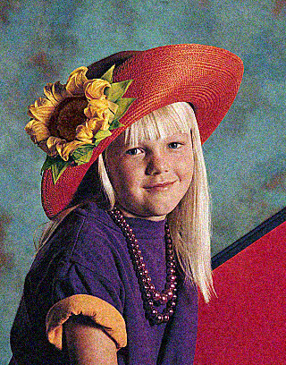
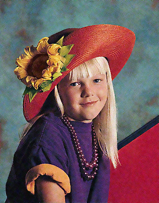

# Image-denoising
Image denoising using K Nearest Neighbors filter implemented in CUDA technology

## Overview
This application uses a K Nearest Neighbors filter to remove noise from images. The project was based on [this paper](http://developer.download.nvidia.com/compute/cuda/1_1/Website/projects/imageDenoising/doc/imageDenoising.pdf).

## Compilation
In order to compile this program you need a suitable NVIDIA GPU and CUDA development environment.
You can compile the application using a command:

``` 
nvcc knn_image_denoiser.cu -lpng -o knn_image_denoiser
```

## Running the application
In order to run the program, you need to specify two arguments:
- input image path
- output image path

For example:
```
knn_image_denoiser.out input.png output.png
```

## Example images before and after denoising process:






