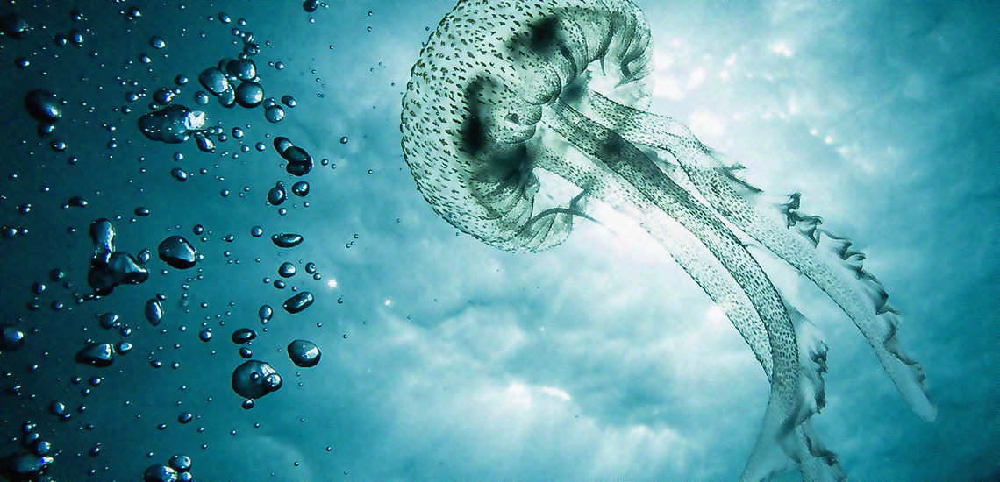
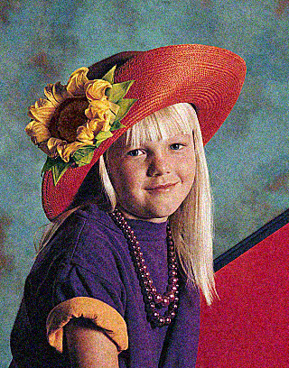

# Image-denoising
Image denoising using K Nearest Neighbors filter implemented in CUDA technology

## Overview
This application uses a K Nearest Neighbors filter to remove noise from images. The project was based on [this paper](https://developer.download.nvidia.com/compute/cuda/1.1-Beta/x86_website/projects/imageDenoising/doc/imageDenoising.pdf).

## Compilation
In order to compile the cuda program you need a suitable NVIDIA GPU and CUDA development environment.
You can compile the application using a command:

``` 
nvcc ./knn_image_denoiser.cu -lpng -o knn_image_denoiser.out
```

Compilation of the other files can be done using:

```
gcc -o knn_image_denoiser_omp -fopenmp -lpng knn_image_denoiser_omp.c
gcc -o knn_image_denoiser -lpng knn_image_denoiser.c
```

## Running the application
In order to run the program, you need to specify two arguments:
- input image path
- output image path

For example:
```
./knn_image_denoiser.out input.png output.png
```


## Example images before and after denoising process:

Noisy image                |  Fixed image
:-------------------------:|:-------------------------:
  |  
  |  
  |  